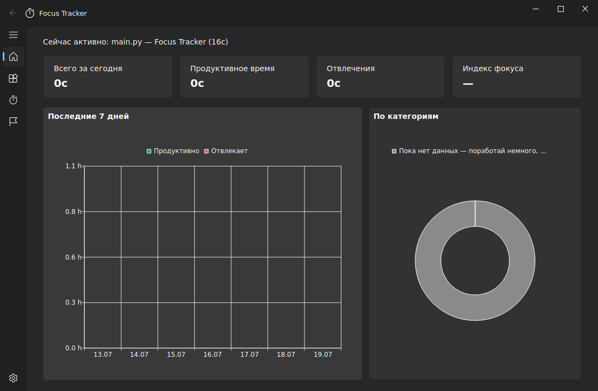
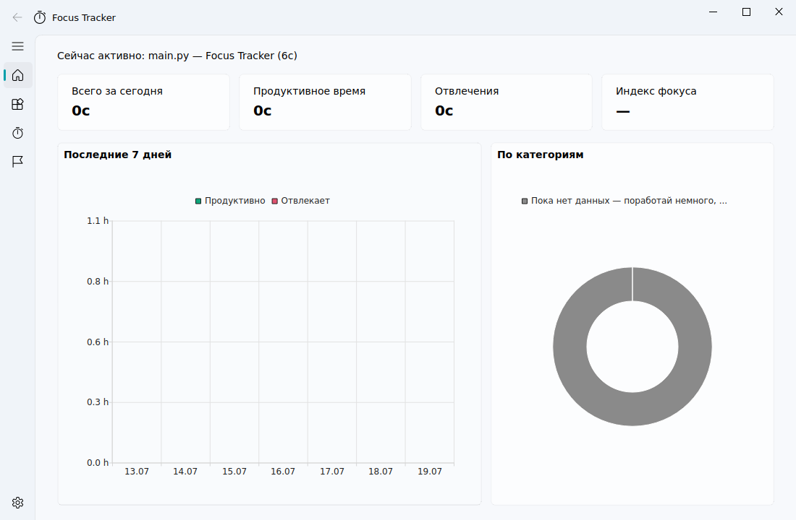

<div align="center">

# ⏱ Focus Tracker

**Трекер фокуса и времени для ПК в стиле Windows 11 (Fluent Design)**

Автоматически отслеживает, в каких приложениях ты проводишь время, показывает статистику продуктивности, помогает фокусироваться с помощью помодоро-таймера и целей.

[](https://github.com/dutow20162007-create/focus-tracker/actions/workflows/build.yml)
[](https://github.com/dutow20162007-create/focus-tracker/releases/latest)
[](https://www.python.org/)
[](LICENSE)

 

</div>

---

## 📥 Установка

Скачай **FocusTrackerSetup.exe** из [последнего релиза](https://github.com/dutow20162007-create/focus-tracker/releases/latest) и запусти. Установщик:
- ставит приложение в `%LOCALAPPDATA%\FocusTracker` (без прав администратора);
- создаёт ярлыки на рабочем столе и в меню «Пуск»;
- добавляет деинсталлятор в «Установку и удаление программ».

Либо возьми портативный `FocusTracker.exe` оттуда же — он работает без установки.

## ✨ Возможности

| | |
|---|---|
| 🪟 **Авто-трекинг окон** | Приложение само фиксирует, какое окно активно, и считает время по каждому приложению |
| 😴 **Детект простоя** | Если ты отошёл от ПК, время не засчитывается (порог настраивается) |
| 🏷 **Категории** | Помечай приложения как «Продуктивно», «Нейтрально» или «Отвлекает» |
| 📊 **Дашборд** | Карточки статистики, индекс фокуса, график за 7 дней, диаграмма по категориям |
| 🍅 **Помодоро** | Таймер работы/перерывов с раундами и длинными перерывами |
| 🎯 **Цели** | «Не менее N минут продуктивно» или «не более N минут отвлечений» в день, с прогресс-барами |
| 🔔 **Уведомления** | Об отвлечениях сверх лимита, достижении целей и окончании помодоро |
| 🖥 **Трей и фон** | При закрытии сворачивается в трей и продолжает трекать в фоне |
| 🚀 **Автозапуск** | Может запускаться вместе с системой |
| 🔄 **Авто-обновления** | Сам проверяет GitHub Releases и предлагает обновиться в один клик |
| 🌗 **Темы** | Тёмная (по умолчанию) и светлая, переключение на лету |
| 🌍 **Языки** | Русский и английский |
| 📤 **Экспорт** | Вся история — в CSV |

## 🎛 Настройки

Всё настраивается на странице «Настройки»:

- **Внешний вид** — тема (тёмная/светлая), язык (RU/EN)
- **Отслеживание** — вкл/выкл трекинга, интервал опроса, порог простоя
- **Помодоро** — длительность работы, перерывов, число раундов
- **Уведомления** — вкл/выкл, предупреждения об отвлечениях, дневной лимит
- **Общие** — автозапуск с системой, сворачивание в трей
- **Данные** — экспорт в CSV, очистка истории
- **Обновления** — ручная проверка новых версий

## 🖥 Работа в фоне

При нажатии на «✕» приложение не закрывается, а уходит в системный трей и продолжает отслеживать активность. Клик по иконке в трее — открыть окно, правый клик — меню с выходом. Поведение можно отключить в настройках («Сворачивать в трей при закрытии»).

## 🚀 Запуск из исходников

```bash
git clone https://github.com/dutow20162007-create/focus-tracker.git
cd focus-tracker
pip install -r requirements.txt
python main.py
```

Работает на Windows, Linux (X11) и macOS. Python 3.10+.

## 🔨 Сборка

**Локально (Windows):** запусти `build.bat` — соберёт `dist\FocusTracker.exe` через PyInstaller.

**Установщик:** нужен [NSIS](https://nsis.sourceforge.io/): `makensis /DVERSION=1.0.0 installer.nsi` → `FocusTrackerSetup.exe`.

**CI:** GitHub Actions собирает exe и установщик на каждый пуш в `main`. Пуш тега `v*` (например `v1.1.0`) автоматически создаёт релиз с файлами — и все установленные приложения предложат пользователям обновиться.

## 🧱 Технологии

- [PyQt6](https://pypi.org/project/PyQt6/) + [PyQt6-Charts](https://pypi.org/project/PyQt6-Charts/) — GUI и графики
- [PyQt6-Fluent-Widgets](https://github.com/zhiyiYo/PyQt-Fluent-Widgets) — компоненты в стиле Windows 11 Fluent Design
- SQLite — локальное хранение истории (никакие данные никуда не отправляются)
- PyInstaller + NSIS — сборка exe и установщика

## 📁 Структура проекта

```
focus-tracker/
├── main.py                    # точка входа
├── focus_tracker/
│   ├── tracker.py             # трекинг активных окон + детект простоя
│   ├── database.py            # SQLite: активность, категории, цели
│   ├── config.py              # настройки приложения
│   ├── i18n.py                # переводы RU/EN
│   ├── updater.py             # авто-обновления через GitHub Releases
│   ├── main_window.py         # главное окно, трей, уведомления
│   └── views/                 # страницы: дашборд, приложения, помодоро, цели, настройки
├── installer.nsi              # скрипт установщика NSIS
├── build.bat                  # локальная сборка exe
└── .github/workflows/build.yml  # CI: сборка exe + установщика + релизы
```

## 📄 Лицензия

MIT
